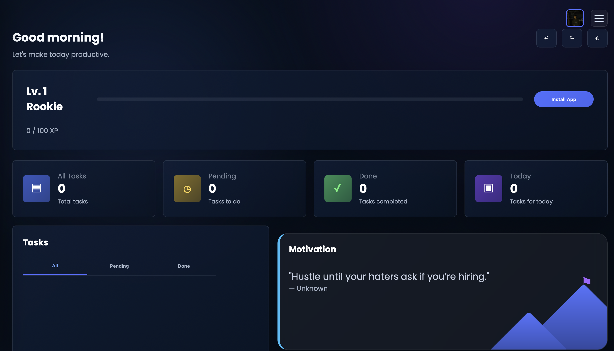
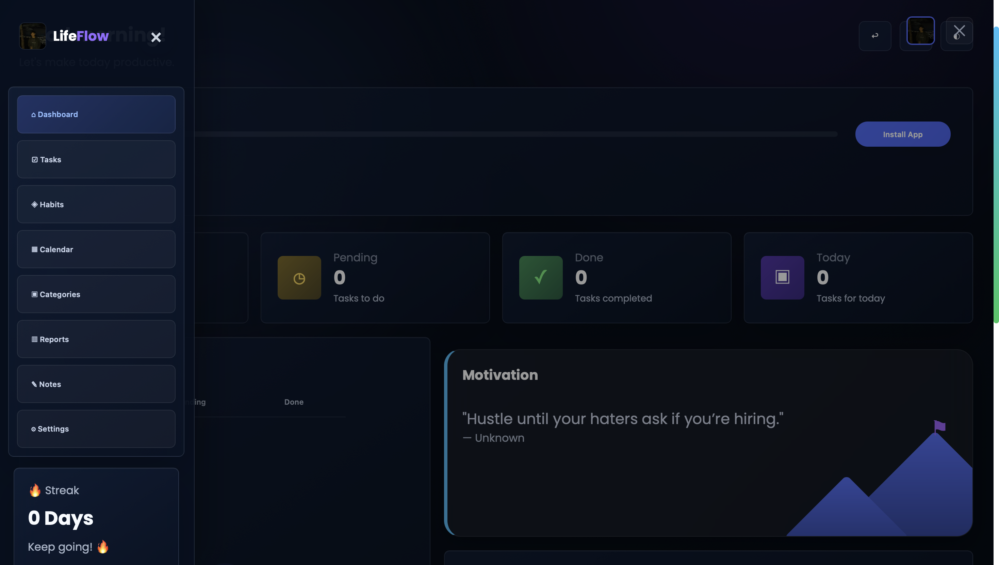
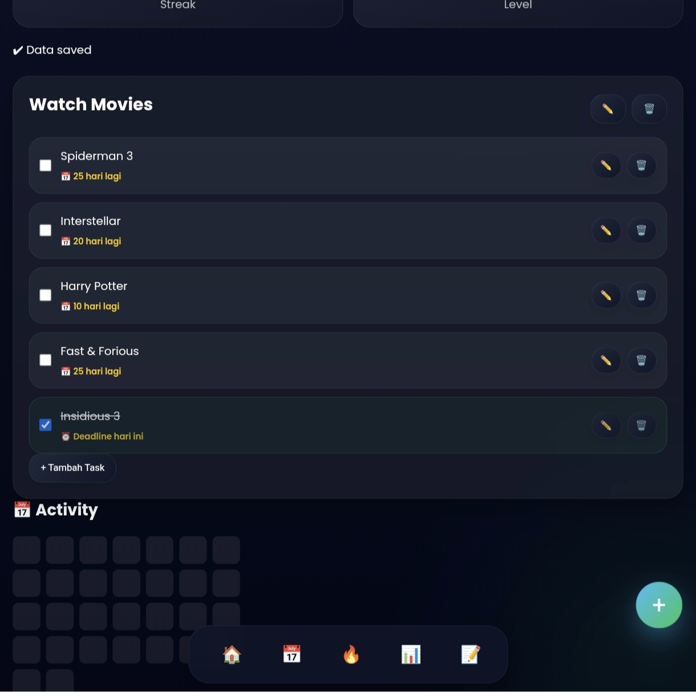
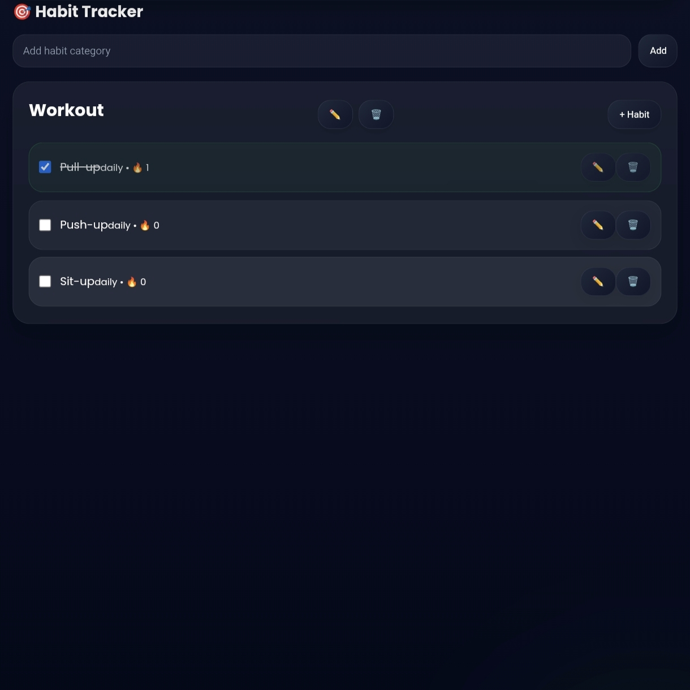
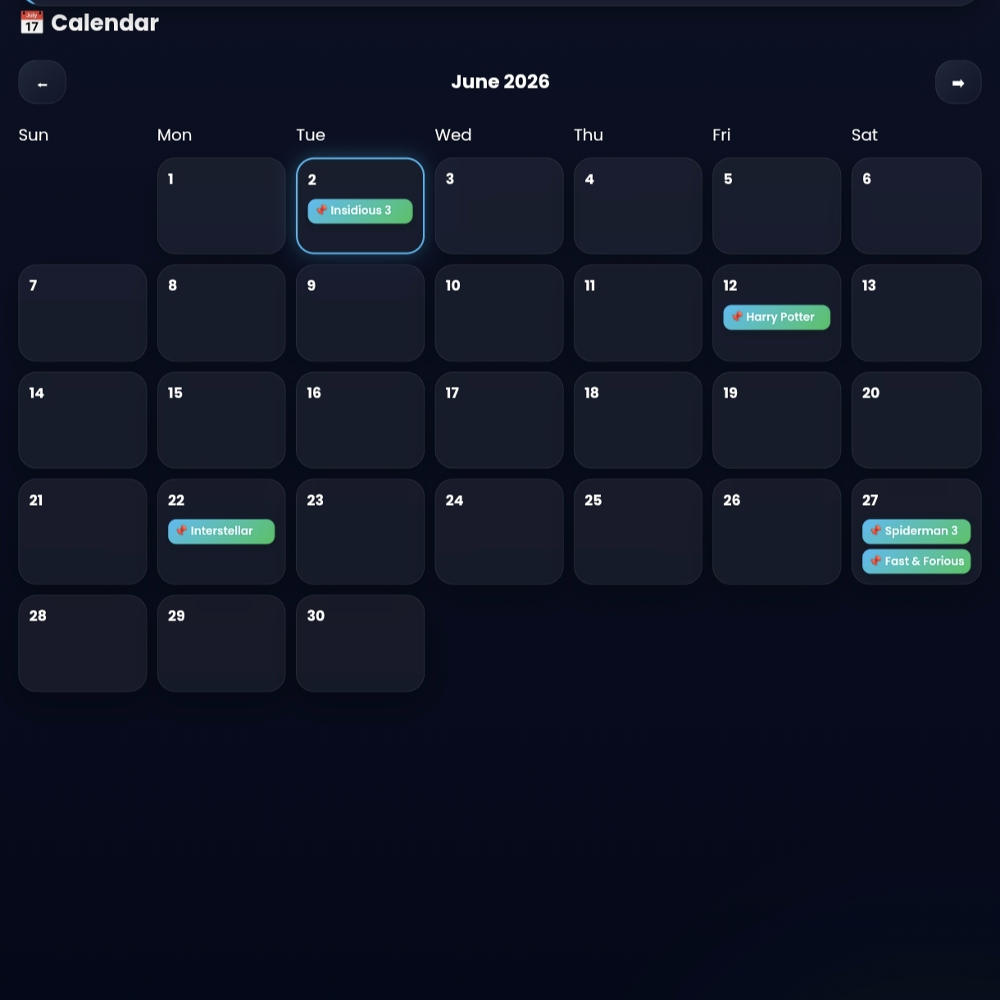
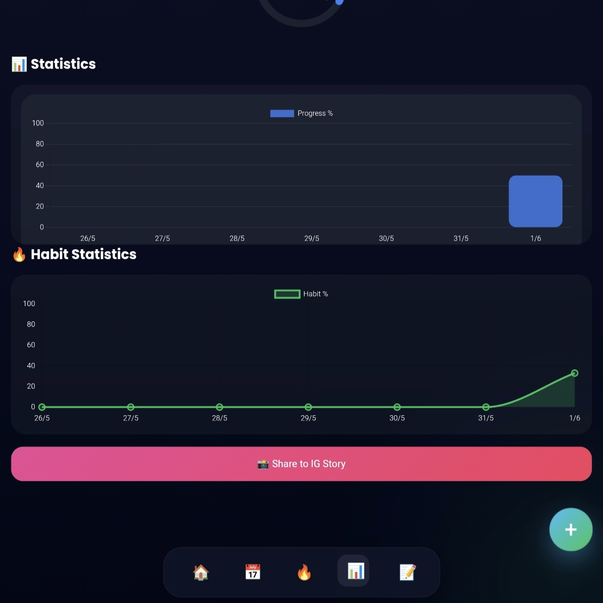

# LifeFlow: Your Personal Productivity Companion

LifeFlow is a modern, all-in-one productivity web application designed to help you manage tasks, build healthy habits, track your progress, and stay consistent every day. It's built as a Progressive Web App (PWA) for a seamless, native-like experience across all your devices.

## 🚀 Live Demo

-   **Demo**: https://todo-app-self-tau-89.vercel.app/
-   **GitHub Repository**: https://github.com/jonnyficky2/LifeFlow

---

✨ Features

📝 Task Management

- Create, edit, delete tasks
- Task priority system
- Search and filter tasks
- Due date management
- Subtask management
- Undo / Redo actions

🎯 Habit Tracker

- Daily habit tracking
- Habit completion history
- Streak calculation
- Consistency monitoring

📅 Calendar View

- Monthly calendar interface
- View tasks by date
- Quick navigation between months

📊 Productivity Analytics

- Weekly productivity chart
- Task completion statistics
- Habit performance insights
- Progress visualization
- Dynamic charts (lazy-loaded)

📒 Notes

- Create and manage personal notes
- Quick note-taking system
- Local storage persistence

🎮 Gamification

- XP system
- Level progression with unique titles
- Productivity streak tracking

🌙 User Experience

- Dark / Light theme
- System theme preference
- Responsive mobile-first design
- Toast notifications
- Smooth animations

📦 Progressive Web App (PWA)

- Installable on mobile devices
- Offline support with fallback page
- Fast loading experience
- Automatic update checks via service worker

💾 Data Management

- Automatic local saving
- Export data to JSON
- Import backup data
- Secure local storage

---

🛠️ Tech Stack

Technology| Purpose
HTML5| Structure
CSS3| Styling
Vanilla JavaScript| Application Logic
Chart.js| Statistics & Charts
LocalStorage API| Data Persistence
Notification API| Reminders
Service Worker| Offline Support
PWA| App Installation

---

📸 Screenshots

### Dashboard

### Menu

### Tasks

### Habits

### Calendar

### Statistics

---

📂 Project Structure

LifeFlow/
│
├── index.html
├── manifest.json
├── sw.js
│
├── css/
│   └── style.css
│
├── js/
│   ├── core/
│   ├── task/
│   ├── habit/
│   ├── stats/
│   ├── ui/
│   ├── modules/
│   └── pwa/
│
└── assets/

---

🚀 Getting Started

Clone the repository:

git clone https://github.com/jonnyficky2/LifeFlow.git

Open the project:

index.html

Or run it using Live Server.

---

🎯 Roadmap

- Achievement & Badge System
- Goal Tracking
- Activity Timeline
- Cloud Synchronization
- Multi-device Support
- Android APK Version

---

👨‍💻 Developer

Created by Jonny Ficky

Information Systems Student | Web Developer | Productivity App Enthusiast

---

⭐ If you like this project, consider giving it a star on GitHub.
