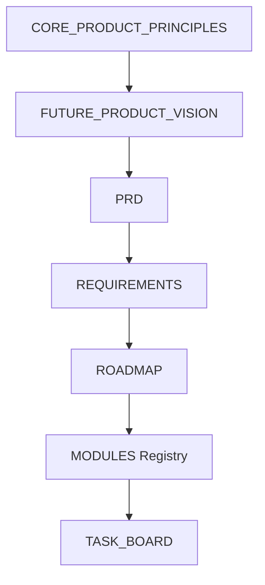

# LifeFlow Knowledge Base

Selamat datang di repositori dokumentasi LifeFlow. Dokumentasi ini tidak sekadar berisi instruksi, melainkan merupakan **Knowledge Graph** yang saling terhubung—dirancang untuk dipahami oleh Manusia maupun AI Agent secara setara.

## 1. Single Source of Truth
Segala hal terkait arah pengembangan, arsitektur, dan prinsip produk harus selalu merujuk pada:
1. **[CORE_PRODUCT_PRINCIPLES.md](./product/CORE_PRODUCT_PRINCIPLES.md)** (Konstitusi Produk)
2. **[FUTURE_PRODUCT_VISION.md](./product/FUTURE_PRODUCT_VISION.md)** (Visi Jangka Panjang)

Tidak ada satupun dokumen, fitur, atau kode yang boleh bertentangan dengan kedua dokumen di atas.

## 2. Struktur Folder & Kategori
- `docs/product/` ➔ Strategi produk, PRD, dan ide (*Product Vision, Principles, PRD, IDEAS*).
- `docs/project/` ➔ Manajemen rilis dan *workflow* operasional (*MODULES, TASK_BOARD, PROJECT_STATE, WORKFLOW, POLICIES*).
- `docs/design/` ➔ UI/UX, Wireframes, dan Design System (*Screen Inventory, User Flows, Design Principles*).
- `docs/testing/` ➔ Skenario UAT dan metrik kualitas (*UAT Checklists*).

## 3. Knowledge Graph (Hubungan Antar Dokumen)
Setiap dokumen di repositori ini dilengkapi dengan *Frontmatter Metadata* (`parent`, `child`, `reference`).  
Alur besarnya adalah: **Vision ➔ PRD ➔ Requirements ➔ Roadmap ➔ Modules ➔ Task Board ➔ Code**.

## 4. Recommended Reading Order
Untuk Developer, Stakeholder, maupun AI yang baru masuk ke repositori ini, wajib membaca dokumen dalam urutan berikut:

1. [CORE_PRODUCT_PRINCIPLES.md](./product/CORE_PRODUCT_PRINCIPLES.md)
2. [FUTURE_PRODUCT_VISION.md](./product/FUTURE_PRODUCT_VISION.md)
3. [PRD.md](./product/PRD.md)
4. [REQUIREMENTS.md](./REQUIREMENTS.md)
5. [ROADMAP.md](./ROADMAP.md)
6. [ARCHITECTURE.md](./ARCHITECTURE.md)
7. [DESIGN_SYSTEM.md](./design/design_system.md)
8. [MODULES.md](./project/MODULES.md)
9. [TASK_BOARD.md](./project/TASK_BOARD.md)
10. [DEVELOPMENT_WORKFLOW.md](./project/DEVELOPMENT_WORKFLOW.md)
11. [UAT_CHECKLIST_PHASE2.md](./testing/UAT_CHECKLIST_PHASE2.md)
12. [PROJECT_STATE.md](./project/PROJECT_STATE.md)

## 5. Cara Menggunakan Dokumentasi Saat Development
1. **Cek `TASK_BOARD.md`**: Selalu mulai dari tugas yang ada di kolom READY atau IN_PROGRESS.
2. **Kerjakan & Patuhi SOP**: Ikuti [DEVELOPMENT_WORKFLOW.md](./project/DEVELOPMENT_WORKFLOW.md) (jangan melompati QA/UAT).
3. **Jangan Bikin Dokumen Baru Tanpa Alasan**: LifeFlow berada pada **Documentation Freeze v1.0**. Patuhi aturan [DOCUMENTATION_POLICY.md](./project/DOCUMENTATION_POLICY.md) sebelum memodifikasi file *markdown*.
