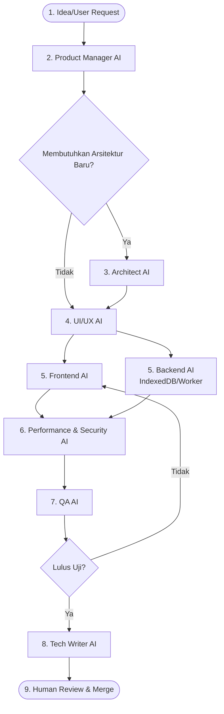

# AI Workflow

Pengembangan perangkat lunak menggunakan Multi-Agent AI membutuhkan rantai komando yang ketat. Semua fitur baru di LifeFlow wajib mengalir melalui struktur pipa kerja (*pipeline*) berikut untuk mencegah korupsi arsitektur.

## Alur Multi-Agent (Pipeline)

## Rincian Tahap demi Tahap

### 1. Idea (Manusia)
* **Aksi**: Anda (Manusia) memiliki permintaan atau fitur baru (contoh: "Tolong tambahkan *Focus Timer*").
* **Deliverable**: *Prompt* mentah di antarmuka obrolan (Chat UI).

### 2. Product Manager (PM) AI
* **Aksi**: Menganalisis ide mentah terhadap `MASTER_SOURCE_OF_TRUTH.md`. Menulis *User Stories* dan *Acceptance Criteria* (AC).
* **Deliverable**: Pembuatan tugas terstruktur di `TASK_BOARD.md` (Masuk ke status TODO).

### 3. Architect AI
* **Aksi**: Jika tugas memerlukan struktur data baru (seperti skema IndexedDB baru), Architect membuat *Implementation Plan*. 
* **Deliverable**: Draf file teknis (atau *Markdown Implementation Plan*) berisi langkah-langkah, batasan memori, dan nama file yang akan diubah. Keputusan besar dicatat di `DECISION_LOG.md`.

### 4. UI/UX Designer AI
* **Aksi**: Melakukan audit terhadap *Design System*. Memberikan panduan hirarki visual, kelas CSS yang harus digunakan, dan aset *Skeleton Loading* yang diperlukan.
* **Deliverable**: Draf pedoman CSS dan spesifikasi struktur DOM komponen (React).

### 5. Frontend & Backend AI (Implementasi Paralel)
* **Aksi Frontend**: Menulis komponen React (`.tsx`) dan mengimpor kait (*hooks*). Fokus pada *Clean Code* dan sinkronisasi status (State).
* **Aksi Backend**: (Jika ada), menulis *Web Workers*, *Database Adapters* Dexie.js, atau manajemen OPFS.
* **Deliverable**: Modifikasi baris kode *source code*. Status di `TASK_BOARD.md` diubah menjadi `TESTING`.

### 6. Performance & Security AI (Reviewer Khusus)
* **Aksi**: Melakukan inspeksi statik (*self-review*) untuk mendeteksi *re-renders* (React), *bundle bloat*, dan potensi ancaman (*XSS/Sanitization* pada input).
* **Deliverable**: Rekomendasi refaktor (jika perlu) sebelum dikirim ke QA.

### 7. QA Engineer AI
* **Aksi**: Menganalisis apakah *Acceptance Criteria* dari PM telah terpenuhi. Menghasilkan *Manual UAT Checklist* atau menguji secara proaktif jika lingkungan CI (*Continuous Integration*) terhubung.
* **Deliverable**: Laporan *Pass/Fail* terhadap fitur yang dibuat.

### 8. Tech Writer AI
* **Aksi**: Setelah fitur dinyatakan berhasil, agen memperbarui direktori `docs/`. Mengedit daftar modul di `MODULES.md` menjadi `DONE`.
* **Deliverable**: *Source of Truth* dan dokumentasi terpadu (Up-to-date).

### 9. Human Review & Merge (Manusia)
* **Aksi**: Manusia (Anda) memegang hak **Veto**. Mengeksekusi UI aplikasi, mengecek *feel* dan *performance*. 
* **Deliverable**: Klik *Git Commit* dan dorong (push) ke repositori.

## Panduan Transisi Antar AI (Handoff)
Karena Anda mungkin menggunakan model LLM yang berbeda (misalnya: menggunakan Claude untuk Arsitektur, dan GPT-4o untuk Koding), Anda wajib memindahkan konteks:
> **Tips Handoff:**
> "Anda adalah Frontend Engineer AI. PM dan Architect AI baru saja menyetujui *Implementation Plan* terlampir. Silakan mulai implementasikan *Step 1* sesuai *Design System*."
