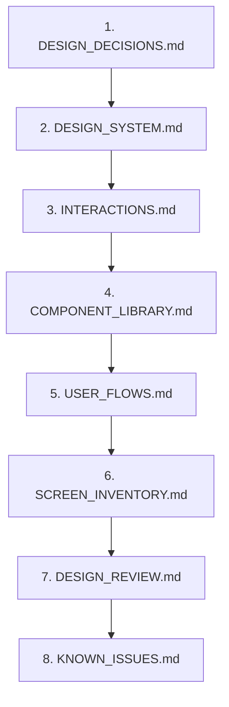

# LifeFlow Design Knowledge Base: Reading Order & Index

Selamat datang di Basis Pengetahuan Desain (Design Knowledge Base) LifeFlow. Dokumen ini dirancang sebagai pintu masuk utama (Entry Point) bagi pengembang manusia maupun agen AI untuk memahami sistem desain, aturan interaksi, dan spesifikasi antarmuka LifeFlow secara bertahap dan terstruktur.

---

## 1. Urutan Membaca (Reading Order)

Untuk memahami arsitektur desain LifeFlow secara utuh, pembaca (baik manusia maupun AI) sangat disarankan untuk mengikuti urutan berikut:

1. **[DESIGN_DECISIONS.md](file:///Users/jofi/Documents/PROJECT/LifeFlow/docs/design/DESIGN_DECISIONS.md) (Konstitusi Desain)**  
   *Mengapa sistem ini dibuat seperti sekarang?* Berisi keputusan arsitektur desain fundamental seperti pendekatan Local-First, Markdown-First, dan unifikasi font Poppins.
2. **[DESIGN_SYSTEM.md](file:///Users/jofi/Documents/PROJECT/LifeFlow/docs/design/DESIGN_SYSTEM.md) (Bahasa Visual & Token)**  
   *Bagaimana warna, ukuran font, dan jarak didefinisikan?* Berisi spesifikasi warna (Light & Dark), skala tipografi Poppins, spacing 8pt grid, radius, shadow, serta standardisasi tombol & input.
3. **[INTERACTIONS.md](file:///Users/jofi/Documents/PROJECT/LifeFlow/docs/design/INTERACTIONS.md) (Perilaku & Gerak)**  
   *Bagaimana komponen berinteraksi dan berpindah?* Detail transisi sliding sidebar, efek modal, micro-interaction sukses, focus outlines a11y, dan scrollbar.
4. **[COMPONENT_LIBRARY.md](file:///Users/jofi/Documents/PROJECT/LifeFlow/docs/design/COMPONENT_LIBRARY.md) (Pustaka Komponen)**  
   *Bagaimana struktur dan API dari komponen-komponen UI yang dapat digunakan kembali (reusable)?* Spesifikasi visual untuk Skeleton loader, EmptyState, Toast, Button, Input, dan Modal.
5. **[USER_FLOWS.md](file:///Users/jofi/Documents/PROJECT/LifeFlow/docs/design/USER_FLOWS.md) (Alur Interaksi Pengguna)**  
   *Bagaimana alur kerja (workflow) utama dijalankan di aplikasi?* Detail langkah-langkah onboarding, pembuatan task (inline & modal), pencatatan catatan, and habit tracking.
6. **[SCREEN_INVENTORY.md](file:///Users/jofi/Documents/PROJECT/LifeFlow/docs/design/SCREEN_INVENTORY.md) (Daftar Halaman & State)**  
   *Halaman apa saja yang ada dan bagaimana state-nya?* Inventori detail untuk Dashboard, Tasks, Habits, Calendar, Notes, dan Settings beserta deskripsi kondisi Empty, Loading, dan Error.
7. **[DESIGN_REVIEW.md](file:///Users/jofi/Documents/PROJECT/LifeFlow/docs/design/DESIGN_REVIEW.md) (Penjaminan Kualitas Desain)**  
   *Bagaimana cara menguji kelayakan desain sebelum rilis?* Pedoman QA desain, panduan pengujian regresi visual, dan UAT Checklist.
8. **[KNOWN_ISSUES.md](file:///Users/jofi/Documents/PROJECT/LifeFlow/docs/design/KNOWN_ISSUES.md) (Log Masalah Aktif)**  
   *Apa saja kendala visual/UX yang saat ini sedang dipantau?* Daftar bug visual aktif dan riwayat regresi visual.

---

## 2. Panduan Integrasi untuk AI Agent

Saat memproses kode CSS atau React yang berkaitan dengan UI/UX LifeFlow:
1. **Verifikasi Token**: Selalu baca `DESIGN_SYSTEM.md` terlebih dahulu untuk memastikan kelas CSS yang ditulis menggunakan nama variabel warna, spacing, dan radius terpadu yang valid.
2. **Periksa Aturan Interaksi**: Rujuk `INTERACTIONS.md` saat mengubah transisi, fokus tombol, atau menu sliding.
3. **Validasi State**: Pastikan file React yang Anda ubah memuat state sesuai dengan spesifikasi di `SCREEN_INVENTORY.md`.
