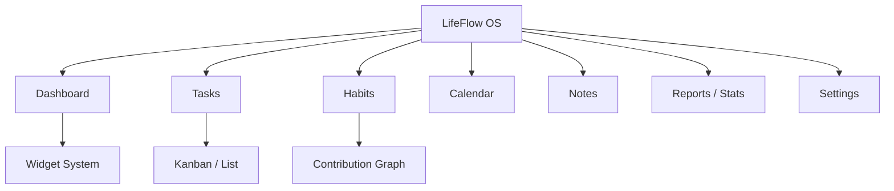
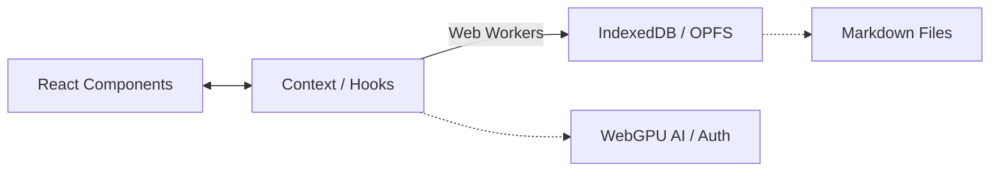

# 👑 LifeFlow Master Source of Truth (v1.1)

> Dokumen ini merupakan referensi utama (Single Source of Truth) untuk seluruh aspek produk, teknis, dan desain dari LifeFlow. Seluruh anggota tim (termasuk AI) diwajibkan mengacu pada dokumen ini untuk menjaga konsistensi visi dan implementasi.

---

## 1. Executive Summary
✅ Done
LifeFlow adalah aplikasi *Personal Operating System* berbasis Web/Desktop yang menggabungkan manajemen tugas, penjadwalan, pelacakan kebiasaan (habit), pencatatan (notes), dan widget sistem ke dalam satu alur kerja yang mulus. Mengusung arsitektur *Local-First* dan *Markdown-First*, LifeFlow memberikan kedaulatan data mutlak kepada pengguna sambil menawarkan integrasi AI yang bertindak sebagai *invisible collaborator*. Tujuannya adalah menyingkirkan hambatan mental antara ide dan eksekusi.

---

## 2. Product Vision
✅ Done
* **Visi**: "Semua yang Anda butuhkan untuk mengatur hidup, pekerjaan, dan kode Anda ada di dalam satu aliran." LifeFlow berevolusi dari aplikasi *To-Do list* sederhana menjadi *Personal Operating System* tingkat lanjut.
* **Misi**: Menyingkirkan semua hambatan mental dan teknis (*friction*) antara ide dan eksekusi, serta beradaptasi organik dengan cara kerja pengguna.
* **Nilai Produk**: Kedaulatan Data (Data Sovereignty), Kecepatan (Speed), Keindahan Minimalis (Minimalist Beauty), dan Eksekusi Tanpa Hambatan (Frictionless Execution).

---

## 3. Product Philosophy
✅ Done
* **Local First**: Aplikasi berfungsi secara penuh dan cepat dengan data tersimpan di perangkat pengguna.
* **Offline First**: Fungsionalitas inti tidak bergantung pada koneksi internet.
* **Privacy First**: Enkripsi dan kontrol data sepenuhnya di tangan pengguna.
* **AI sebagai Assistant**: *Invisible AI*—AI mengamati konteks dan memberi wawasan tanpa mengganggu. AI adalah rekan kerja, bukan sekadar chatbot.
* **Highly Customizable**: Fleksibel namun tetap terstruktur. Mendukung penyesuaian tema dan widget.
* **Modular**: Setiap fitur (Tasks, Habits, Notes) dapat berdiri sendiri.
* **Fast**: Harus berjalan di 60fps dengan latensi nyaris nol (Zero-Latency).
* **Beautiful**: Estetika modern (Glassmorphism, AMOLED, Material You) dengan tipografi dan spasi yang sempurna.
* **Minimal**: UI/UX tenang tanpa clutter.
* **Productivity OS**: Bukan sekadar aplikasi, melainkan platform tempat seluruh alur kerja terjadi.

---

## 4. Product Goals
✅ Done
* **Jangka Pendek (0-6 Bulan)**: Mencapai status *Feature Complete* untuk modul inti (Dashboard, Tasks, Calendar, Habits, Notes) dengan performa 60fps berbasis *Local Storage*.
* **Jangka Menengah (6-12 Bulan)**: Migrasi ke IndexedDB, integrasi File System lokal (Markdown Parser), Widget System (*Strict Grid*), dan integrasi AI Workspace berbasis WebGPU.
* **Jangka Panjang (1-5 Tahun)**: Sinkronisasi *peer-to-peer* (CRDTs), dukungan tim *multi-player*, dan integrasi langsung ke ekosistem developer (Git, CI/CD). Menjadi standar emas *Productivity OS*.

---

## 5. Target Users
✅ Done
* **Persona**: Alex (27), Frontend Developer. Menginginkan satu tempat untuk melacak bug, *side-projects*, rutinitas olahraga tanpa takut *vendor lock-in*.
* **Use Case**: Manajemen sprint mingguan, pelacakan kebiasaan harian, pencatatan hasil meeting, dan perumusan ide kreatif.
* **Pain Point**: Terlalu banyak berpindah antar aplikasi (Context Switching). Kehilangan data saat server aplikasi down. UI yang lambat dan kaku.

---

## 6. Competitive Analysis
✅ Done
* **Notion**: Sangat fleksibel namun lambat saat offline dan *cloud-dependent*. LifeFlow lebih cepat dan *Local-First*.
* **Todoist**: Kuat di task management namun kurang mendukung knowledge base (Notes). LifeFlow menyatukan keduanya.
* **TickTick**: Banyak fitur tapi desain UI kurang premium. LifeFlow mengutamakan desain *beautiful* dan *minimal*.
* **Obsidian**: *Markdown-first* dan *local-first*, namun kurang dalam hal UI Task Management / Habit Tracking yang intuitif. LifeFlow memberikan UI kelas atas di atas markdown.
* **Google Calendar**: Standar kalender, tapi terpisah dari task/notes. LifeFlow menyatukan timeline dan task.
* **Sunsama / Akiflow**: Sangat bagus untuk *time-blocking*, tapi mahal dan *cloud-centric*. LifeFlow menawarkan alternatif privasi-tinggi dan *Local-First*.
* **Kelebihan LifeFlow**: *Local-first*, *Markdown as Single Source of Truth*, super cepat, estetika premium, *Widget System* yang revolusioner, dan *Invisible AI*.

---

## 7. North Star Metric
✅ Done
**Daily Frictionless Flow (DFF)**: Jumlah pengguna aktif harian yang mencatat, menyelesaikan tugas, atau mengelola habit tanpa mengalami *lag*, *error*, atau kebuntuan navigasi. 

---

## 8. Success Metrics
✅ Done
* **Retention**: > 60% W2 Retention (pengguna kembali di minggu kedua).
* **Engagement**: Rata-rata sesi > 5 interaksi per hari per pengguna.
* **Performance**: Waktu inisialisasi aplikasi < 500ms, transisi UI 60fps stabil.
* **Reliability**: 0 laporan *data loss* terkait koneksi terputus.

---

## 9. Information Architecture
✅ Done

---

## 10. Navigation Philosophy
✅ Done
* **Sidebar**: Navigasi utama struktural (Dashboard, Tasks, Habits, dsb) di desktop. Menampilkan status *user* dan grup folder.
* **Bottom Navigation**: Dikhususkan untuk Mobile. Tampil mengambang dengan ikon esensial untuk navigasi cepat menggunakan ibu jari.
* **AI Omnibar (Cmd/Ctrl + K)**: *Unified Input* untuk pengguna *power user*. Bertindak sebagai router: navigasi aplikasi secara statis, pencarian file/task, atau memanggil eksekusi AI, semuanya dalam satu jendela terpusat tanpa merusak antarmuka utama.

---

## 11. User Flow
✅ Done
1. **Onboarding**: Splash screen -> (Opsional) Google Login -> Dashboard.
2. **Task Creation**: Buka aplikasi -> Tekan Enter di inline input (Zero-friction) -> Task tersimpan.
3. **Habit Tracking**: Klik kotak grid di Habit -> Optimistic UI langsung hijau -> XP bertambah.
4. **Note Taking**: Buka Notes -> Buat baru -> Ketik Markdown -> Auto-save via Web Worker ke IndexedDB/OPFS.
5. **Widget Customization**: Dashboard -> Edit Widget -> Drag & Drop ke *Strict Grid* -> Save Layout.

---

## 12. Feature List
✅ Done
* **Core Features**:
  - Task Management (CRUD, Subtask, Prioritas, Inline Input)
  - Habit Tracking (Github-style grid, pengulangan, XP)
  - Notes Editor (Markdown, Auto-save, Pinning)
  - Calendar View (Bulan, Time-blocking, Deadline Sinkron)
  - Dashboard (Activity Heatmap, Motivation, Stat Summaries)
* **Advanced Features**:
  - Focus Timer (Pomodoro dengan gamifikasi XP, Confetti, Sound)
  - Reports & Analytics (Grafik produktivitas mingguan/bulanan)
  - Import/Export JSON Backup
* **Future Features (⏳ Planned)**:
  - Widget System (Platform widget kustom - *Strict Grid*)
  - AI Workspace (Automated task extraction, Auto-prioritization via WebGPU)
  - Sinkronisasi P2P (CRDT - Yjs)
* **Experimental (💡 Future Ideas)**:
  - Widget Marketplace & Plugin Ecosystem
  - Daily Recap Journaling
  - Client-Side E2E Encryption (AES-GCM)

---

## 13. Dashboard
✅ Done
Pusat kendali operasional harian. Menampilkan statistik ringkas (XP, Level, Streak), Heatmap aktivitas bulanan, kutipan motivasi yang berganti dinamis (Local-first), dan akan segera menjadi kanvas utama untuk **Widget System**.

---

## 14. Tasks
✅ Done
Sistem manajemen pekerjaan dengan *Inline Input* untuk *zero-friction*. Mendukung kategori, tenggat waktu, sub-tugas, tingkat prioritas (High, Medium, Low), dan fitur *Undo/Redo* untuk mencegah kehilangan data akibat salah klik.

---

## 15. Habits
✅ Done
Pelacakan rutinitas menggunakan kontribusi visual bergaya GitHub grid. Mendukung interval (Harian, Mingguan, Spesifik hari). Memberikan umpan balik instan (Optimistic UI) dan berkontribusi langsung pada Level/XP pengguna.

---

## 16. Calendar
✅ Done
Visualisasi kalender bulanan penuh. Secara otomatis menarik data tugas yang memiliki batas waktu (deadline) dan menampilkannya pada sel tanggal yang relevan. *Time-blocking* untuk jadwal harian.

---

## 17. Notes
✅ Done
Editor teks dengan arsitektur dua panel (Sidebar List & Editor Kanan). Sepenuhnya berbasis Markdown. Mendukung *auto-save*, pengaturan metadata (deadline, reminder), dan penyematan catatan (📌 Pinned). Penyimpanan difokuskan ke *Origin Private File System (OPFS)* untuk penanganan gambar yang lebih baik.

---

## 18. Countdown
✅ Done (via Focus Timer)
Modul pengatur waktu fokus (Pomodoro) dengan durasi 25, 50, 15, atau 5 menit. Memiliki visual SVG ring countdown yang stabil, diiringi integrasi *canvas-confetti* dan Web Audio saat sesi selesai, yang langsung menambahkan XP pengguna.

---

## 19. Statistics
✅ Done
Laporan produktivitas dan wawasan mingguan/bulanan. Menampilkan tren penyelesaian Tasks dan konsistensi Habits (Habit History) tanpa bergantung pada library *cloud* berbayar, dilengkapi fitur ekspor performa sebagai Canvas Image.

---

## 20. Widget System (FLAGSHIP FEATURE)
🚧 In Progress / ⏳ Planned

Sistem Widget LifeFlow adalah fondasi *dashboard* interaktif. Disederhanakan (*Strict Grid*) agar performa UI tetap maksimal.

### Komponen Utama:
* **Widget Architecture**: Terisolasi per komponen React, dikelola oleh *Widget Engine*.
* **Widget Engine**: Pengelola tata letak berbasis **Strict Grid (1x1, 2x1, 2x2)** untuk memastikan proses rendering stabil dan ringan. Bebas koordinat statis ditiadakan.
* **Widget Builder**: Antarmuka visual *Drag & Drop* dengan metode Snap-to-Grid ketat.
* **Widget Renderer**: Virtualisasi rendering pada grid untuk performa 60fps mutlak.
* **Widget Template**: Bundel desain bawaan (Minimal, AMOLED, Material You, Glass, iOS, Retro).
* **Widget Theme**: Kustomisasi warna, *corner radius*, transparansi via CSS variabel komponen.
* **Widget Sync**: Realtime Sync menyimpan konfigurasi *layout* ke *IndexedDB*.
* **Widget Export**: Ekspor JSON layout, atau di-render menjadi PNG.
* **Widget Data Source & API**: Hooks internal mengambil metrik dari modul lain.
* **Widget Storage**: State lokal per-widget. Data dikueri secara terpusat tanpa prop-drilling berlebih.
* **Widget Performance**: *Lazy loading* komponen; tidak merender ulang satu *dashboard* jika hanya 1 widget berubah.

### Target Platform:
* Web Widget & Desktop Widget (Prioritas Utama)
* PWA Widget (Terintegrasi dengan OS)

---

## 21. AI Workspace
⏳ Planned

AI di LifeFlow bertindak sebagai **Rekan Kerja Intelektual** (Invisible AI). AI terintegrasi di peramban, berjalan lokal agar sesuai filosofi *Privacy First*.

* **AI Router**: Pengarah yang mengeksekusi model berdasarkan kemampuan.
* **Model yang Didukung**:
  - **WebLLM / WebGPU (Local)**: Model lokal berukuran kecil (misal: Llama-3-8B / Qwen-1.5B) yang di-load langsung ke GPU peramban. Sangat privasi dan *seamless* (tidak butuh *setup* aplikasi desktop tambahan).
  - **Gemini / Claude / OpenAI (Cloud Fallback)**: Menggunakan kapabilitas API Key (*Bring Your Own Key*) untuk penalaran tingkat tinggi dan *auto-prioritization* jika model WebLLM lokal tidak mumpuni.
* **Kapan Digunakan?**:
  - *Extract Task*: AI memilah Markdown, mengekstrak "Action Items" menjadi Task dengan deadline.
  - *AI Omnibar (Cmd+K)*: AI memproses *natural language* ("Tunda semua rapat hari ini") dan menjalankan navigasi.
  - *Auto-Prioritize*: Mengkalkulasi ulang prioritas harian berdasarkan beban kerja.

---

## 22. Plugin System
💡 Future Ideas (Ditunda dari MVP)
Sistem ekstensi *logic/background* pihak ketiga. Membutuhkan *Strict Content Security Policy (CSP)* dan *Iframe Sandboxing* untuk mencegah serangan pencurian data (XSS).

---

## 23. Theme System
✅ Done (Sebagian) / 🚧 In Progress
* Tersedia saat ini: **Light**, **Dark**, **System Default**.
* Rencana tambahan: **AMOLED** (True Black), **Material You** (Dynamic Colors), **Glass** (Glassmorphism UI), **Retro** (Pixel/Monospace).
* **Design Token**: Menggunakan root CSS (`--color-primary`) yang aman untuk *update realtime*.

---

## 24. Design System
✅ Done
* **Typography**: Modern sans-serif (Inter / Poppins).
* **Spacing & Radius**: Skala linear (4px, 8px, 12px, 16px, 24px).
* **Shadow**: Elevasi subtil untuk *depth*.
* **Animation**: Kurva bezier mulus (<200ms) tanpa *blocking*.
* **Color Palette**: Minimalis dengan level kontras AA.
* **Component Rules**: Bebas *inline styles*.

---

## 25. UI Guidelines
✅ Done
- Hindari Dialog native peramban (`alert()`, `prompt()`). Gunakan Modal, Toast.
- Semua input tinggi seragam (44px).
- Status kosong (*Empty State*) & Skeleton loading wajib ada.

---

## 26. UX Principles
✅ Done
- **Frictionless**: Hilangkan klik tak perlu (Inline Input).
- **Forgiving**: Akses tombol *Undo/Redo*.
- **Calm**: Kurangi elemen visual distraksi.

---

## 27. Accessibility
✅ Done
- **Keyboard Navigation**, **Focus Indicator**, **Color Contrast (AA)**, **ARIA Labels**.

---

## 28. Tech Stack
✅ Done
* **Frontend**: React (Vite), TypeScript, CSS Variables murni.
* **Background Process**: **Web Workers** (Wajib untuk AI, Parser, & Data Sync).
* **Database Target**: `IndexedDB` (Cache) ↔ `OPFS / File System` (Storage as Truth).
* **Authentication**: Firebase Web SDK (v11).
* **Deployment & CI**: Static Hosting (PWA) & GitHub Actions (Playwright E2E).

---

## 29. Folder Structure
✅ Done
- `docs/`: Dokumentasi (PRD, Arsitektur).
- `public/`: Aset statis PWA.
- `src/`: `components/`, `context/`, `hooks/`, `pages/`, `types/`, `utils/`, `workers/`.

---

## 30. Coding Standard
✅ Done
- **TypeScript Strict**.
- **No Duplicate Logic** & **Minimal Diff**.
- **Clean Architecture** (Abstraksi logic penyimpanan).
- **Predictable Commits** (Contoh: `feat(tasks): [TASK-201] add undo logic`).

---

## 31. Architecture
✅ Done

---

## 32. State Management
✅ Done
Menggunakan React Context API & Custom Hooks. Jika *Widget System* membesar, akan menggunakan perantara state lokal untuk mencegah *prop-drilling* dan re-render ganda.

---

## 33. Database Schema
🚧 In Progress (Proses Normalisasi)
Rencana migrasi menuju **IndexedDB (via Dexie.js / SQLite WASM)** untuk performa relasional. File System (Markdown) adalah salinan mentah.
- **Tabel**: User, Task, Habit, Note.

---

## 34. API Design
⏳ Planned
* Saat ini 100% lokal. Integrasi masa depan ke API AI (OpenAI/Claude) via Bring Your Own Key (BYOK).

---

## 35. Authentication
✅ Done
* Google OAuth via Firebase Web SDK. Tidak wajib (*non-intrusive*).

---

## 36. Notification
✅ Done
* In-app Toast (`ToastSystem`).

---

## 37. Backup Strategy
✅ Done
* JSON Export/Import. Rencana tambahan: Sinkronisasi Fisik via OPFS (Folder Sync).

---

## 38. Export & Import
✅ Done
* Baca/Tulis file JSON.

---

## 39. Sync Strategy
⏳ Planned
* CRDTs (**Yjs** dipilih karena lebih kecil dan tangguh untuk *y-webrtc* & *y-indexeddb*).

---

## 40. Security
✅ Done
* **Strict CSP**: Wajib diatur untuk memitigasi XSS ketika fitur Widget dan Plugin berjalan.
* **Iframe Sandboxing**: Lingkungan eksekusi plugin agar aman.
* *Client-Side AES-GCM* masuk ke *Future Ideas*.

---

## 41. Performance Budget
✅ Done
* **Mandat Khusus**: Eksekusi *WebGPU / WebLLM*, parsing *Markdown* raksasa, dan operasi sinkronisasi **WAJIB** dijalankan pada utas **Web Worker** untuk mencegah antarmuka membeku (UI Jank).
* TTI < 500ms. Transisi 60fps.

---

## 42. Testing Strategy
🚧 In Progress
* *Unit Tests* & *Linting*.
* *Manual UAT*.
* ⏳ Planned: **Automated E2E Testing (Playwright)** untuk proses CRUD di CI/CD.

---

## 43. Release Strategy
✅ Done
* PWA Alpha -> Beta -> v1.0 (RC) -> Continuous Deployment.

---

## 44. Roadmap
✅ Done
- **Tahap 1**: Core Foundation, CRUD, Parity, Auth (SELESAI).
- **Tahap 2**: Migrasi Storage (`localStorage` -> `IndexedDB` -> OPFS). (Kritis)
- **Tahap 3**: Widget System (Strict Grid).
- **Tahap 4**: AI Workspace terintegrasi WebLLM/WebGPU.

---

## 45. Progress Tracker
* **✅ Done**: App Shell, Navigation, UI Component, Tasks, Habits, Notes, Auth, PWA, Audit V1.1.
* **🚧 In Progress**: Pembersihan UI Akhir.
* **⏳ Planned**: Migrasi IndexedDB, Playwright E2E, Widget Strict Grid, WebGPU AI.
* **💡 Future Ideas**: Plugin Ecosystem, Widget Marketplace, WebRTC P2P Sync, AES-GCM.

---

## 46. Decision History
✅ Done
*(Ref: Audit Report v1.1)*
* **WebLLM vs Ollama**: Ollama dihapus karena PWA tidak bisa menjalankan *native binary*. Menggunakan WebLLM/WebGPU.
* **Unified AI Omnibar**: Pemisahan Cmd+K dan AI dibatalkan. Keduanya dilebur jadi satu.
* **Strict Grid vs Free Drag-Drop**: Drag-Drop bebas dibatalkan untuk *Widget* karena merusak rendering 60fps; diganti ke *Strict Grid*.

---

## 47. Future Ideas
💡 Future Ideas
- Widget Marketplace
- Plugin System
- P2P Workspace via WebRTC
- Client-Side E2E Encryption (AES-GCM)
- Daily Recap Journaling

---

## 48. Open Questions
❓Needs Decision
1. **PWA App Store**: Mengemas ke TWA untuk Play Store, atau peramban murni?
2. **Attachment Storage**: Simpan gambar (Notes) di OPFS lokal agar tidak membebani IndexedDB base64? *(Rekomendasi: Ya, gunakan OPFS).*

---

## 49. Final Recommendation (v1.1)
✅ Done

* "Arsitektur *Local-First* ini brilian, namun **titik lemah terbesarnya adalah batas 5MB localStorage dan performa UI**. Sebelum mengerjakan *Widget System*, Anda **WAJIB** bermigrasi ke `IndexedDB` (contoh: *Dexie.js*) dan memindahkan semua beban berat (Parsing Markdown & AI WebLLM) ke **Web Workers**. 
* Jangan mengizinkan sembarang kode kustom (*Plugin*) tanpa *Iframe Sandbox* dan *Strict CSP*, karena data lokal sangat rawan dicuri lewat serangan XSS. 
* Dengan arah ini, LifeFlow berpotensi menjadi *Anti-Cloud OS* terkuat di kelasnya."
