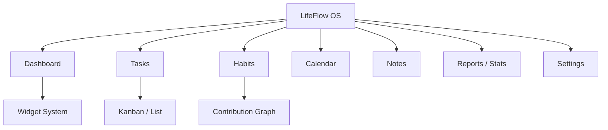
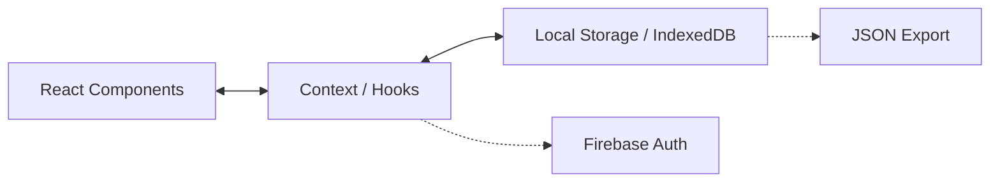

# 👑 LifeFlow Master Source of Truth

> Dokumen ini merupakan referensi utama (Single Source of Truth) untuk seluruh aspek produk, teknis, dan desain dari LifeFlow. Seluruh anggota tim (termasuk AI) diwajibkan mengacu pada dokumen ini untuk menjaga konsistensi visi dan implementasi.

---

## 1. Executive Summary
✅ Done
LifeFlow adalah aplikasi *Personal Operating System* berbasis Web/Desktop yang menggabungkan manajemen tugas, penjadwalan, pelacakan kebiasaan (habit), pencatatan (notes), dan widget sistem ke dalam satu alur kerja yang mulus. Mengusung arsitektur *Local-First* dan *Markdown-First*, LifeFlow memberikan kedaulatan data mutlak kepada pengguna sambil menawarkan integrasi AI yang bertindak sebagai *invisible collaborator*. Tujuannya adalah menyingkirkan hambatan mental antara ide dan eksekusi.

---

## 2. Product Vision
✅ Done
* **Visi**: "Semua yang Anda butuhkan untuk mengatur hidup, pekerjaan, dan kode Anda ada di dalam satu aliran." LifeFlow berevolusi dari aplikasi *To-Do list* sederhana menjadi *Personal Operating System* tingkat lanjut.
* **Misi**: Menyingkirkan semua hambatan mental dan teknis (*friction*) antara ide dan eksekusi, serta beradaptasi organik dengan cara kerja pengguna.
* **Nilai Produk**: Kedaulatan Data (Data Sovereignty), Kecepatan (Speed), Keindahan Minimalis (Minimalist Beauty), dan Eksekusi Tanpa Hambatan (Frictionless Execution).

---

## 3. Product Philosophy
✅ Done
* **Local First**: Aplikasi berfungsi secara penuh dan cepat dengan data tersimpan di perangkat pengguna.
* **Offline First**: Fungsionalitas inti tidak bergantung pada koneksi internet.
* **Privacy First**: Enkripsi dan kontrol data sepenuhnya di tangan pengguna.
* **AI sebagai Assistant**: *Invisible AI*—AI mengamati konteks dan memberi wawasan tanpa mengganggu. AI adalah rekan kerja, bukan sekadar chatbot.
* **Highly Customizable**: Fleksibel namun tetap terstruktur. Mendukung penyesuaian tema dan widget.
* **Modular**: Setiap fitur (Tasks, Habits, Notes) dapat berdiri sendiri.
* **Fast**: Harus berjalan di 60fps dengan latensi nyaris nol (Zero-Latency).
* **Beautiful**: Estetika modern (Glassmorphism, AMOLED, Material You) dengan tipografi dan spasi yang sempurna.
* **Minimal**: UI/UX tenang tanpa clutter.
* **Productivity OS**: Bukan sekadar aplikasi, melainkan platform tempat seluruh alur kerja terjadi.

---

## 4. Product Goals
✅ Done
* **Jangka Pendek (0-6 Bulan)**: Mencapai status *Feature Complete* untuk modul inti (Dashboard, Tasks, Calendar, Habits, Notes) dengan performa 60fps berbasis *Local Storage*.
* **Jangka Menengah (6-12 Bulan)**: Merilis integrasi File System lokal (Markdown Parser), Widget System yang sangat dapat dikustomisasi, dan integrasi AI Workspace dasar.
* **Jangka Panjang (1-5 Tahun)**: Sinkronisasi *peer-to-peer* (CRDTs), dukungan tim *multi-player*, dan integrasi langsung ke ekosistem developer (Git, CI/CD). Menjadi standar emas *Productivity OS*.

---

## 5. Target Users
✅ Done
* **Persona**: Alex (27), Frontend Developer. Menginginkan satu tempat untuk melacak bug, *side-projects*, rutinitas olahraga tanpa takut *vendor lock-in*.
* **Use Case**: Manajemen sprint mingguan, pelacakan kebiasaan harian, pencatatan hasil meeting, dan perumusan ide kreatif.
* **Pain Point**: Terlalu banyak berpindah antar aplikasi (Context Switching). Kehilangan data saat server aplikasi down. UI yang lambat dan kaku.

---

## 6. Competitive Analysis
✅ Done
* **Notion**: Sangat fleksibel namun lambat saat offline dan *cloud-dependent*. LifeFlow lebih cepat dan *Local-First*.
* **Todoist**: Kuat di task management namun kurang mendukung knowledge base (Notes). LifeFlow menyatukan keduanya.
* **TickTick**: Banyak fitur tapi desain UI kurang premium. LifeFlow mengutamakan desain *beautiful* dan *minimal*.
* **Obsidian**: *Markdown-first* dan *local-first*, namun kurang dalam hal UI Task Management / Habit Tracking yang intuitif. LifeFlow memberikan UI kelas atas di atas markdown.
* **Google Calendar**: Standar kalender, tapi terpisah dari task/notes. LifeFlow menyatukan timeline dan task.
* **Sunsama / Akiflow**: Sangat bagus untuk *time-blocking*, tapi mahal dan *cloud-centric*. LifeFlow menawarkan alternatif privasi-tinggi dan *Local-First*.
* **Kelebihan LifeFlow**: *Local-first*, *Markdown as Single Source of Truth*, super cepat, estetika premium, *Widget System* yang revolusioner, dan *Invisible AI*.

---

## 7. North Star Metric
✅ Done
**Daily Frictionless Flow (DFF)**: Jumlah pengguna aktif harian yang mencatat, menyelesaikan tugas, atau mengelola habit tanpa mengalami *lag*, *error*, atau kebuntuan navigasi. 

---

## 8. Success Metrics
✅ Done
* **Retention**: > 60% W2 Retention (pengguna kembali di minggu kedua).
* **Engagement**: Rata-rata sesi > 5 interaksi per hari per pengguna.
* **Performance**: Waktu inisialisasi aplikasi < 500ms, transisi UI 60fps stabil.
* **Reliability**: 0 laporan *data loss* terkait koneksi terputus.

---

## 9. Information Architecture
✅ Done

---

## 10. Navigation Philosophy
✅ Done
* **Sidebar**: Navigasi utama struktural (Dashboard, Tasks, Habits, dsb) di desktop. Menampilkan status *user* dan grup folder.
* **Bottom Navigation**: Dikhususkan untuk Mobile. Tampil mengambang dengan ikon esensial untuk navigasi cepat menggunakan ibu jari.
* **Command Palette**: Cmd/Ctrl + K (Omnibar). Untuk pengguna *power user*, bernavigasi tanpa mouse (search task, ubah tema, buka note).
* **AI Omnibar**: Terintegrasi di Command Palette atau panel khusus untuk memanggil *Invisible AI* tanpa merusak antarmuka utama.

---

## 11. User Flow
✅ Done
1. **Onboarding**: Splash screen -> (Opsional) Google Login -> Dashboard.
2. **Task Creation**: Buka aplikasi -> Tekan Enter di inline input (Zero-friction) -> Task tersimpan.
3. **Habit Tracking**: Klik kotak grid di Habit -> Optimistic UI langsung hijau -> XP bertambah.
4. **Note Taking**: Buka Notes -> Buat baru -> Ketik Markdown -> Auto-save ke LocalStorage/File System.
5. **Widget Customization**: Dashboard -> Edit Widget -> Drag & Drop -> Save Layout.

---

## 12. Feature List
✅ Done
* **Core Features**:
  - Task Management (CRUD, Subtask, Prioritas, Inline Input)
  - Habit Tracking (Github-style grid, pengulangan, XP)
  - Notes Editor (Markdown, Auto-save, Pinning)
  - Calendar View (Bulan, Deadline Sinkron)
  - Dashboard (Activity Heatmap, Motivation, Stat Summaries)
* **Advanced Features**:
  - Focus Timer (Pomodoro dengan gamifikasi XP, Confetti, Sound)
  - Reports & Analytics (Grafik produktivitas mingguan/bulanan)
  - Import/Export JSON Backup
* **Future Features (⏳ Planned)**:
  - Widget System (Platform widget kustom)
  - AI Workspace (Automated task extraction, Auto-prioritization)
  - P2P Workspace via WebRTC
* **Experimental (💡 Future Ideas)**:
  - Daily Recap Journaling
  - Client-Side E2E Encryption (AES-GCM)

---

## 13. Dashboard
✅ Done
Pusat kendali operasional harian. Menampilkan statistik ringkas (XP, Level, Streak), Heatmap aktivitas bulanan, kutipan motivasi yang berganti dinamis (Local-first), dan akan segera menjadi kanvas utama untuk **Widget System**.

---

## 14. Tasks
✅ Done
Sistem manajemen pekerjaan dengan *Inline Input* untuk *zero-friction*. Mendukung kategori, tenggat waktu, sub-tugas, tingkat prioritas (High, Medium, Low), dan fitur *Undo/Redo* untuk mencegah kehilangan data akibat salah klik.

---

## 15. Habits
✅ Done
Pelacakan rutinitas menggunakan kontribusi visual bergaya GitHub grid. Mendukung interval (Harian, Mingguan, Spesifik hari). Memberikan umpan balik instan (Optimistic UI) dan berkontribusi langsung pada Level/XP pengguna.

---

## 16. Calendar
✅ Done
Visualisasi kalender bulanan penuh. Secara otomatis menarik data tugas yang memiliki batas waktu (deadline) dan menampilkannya pada sel tanggal yang relevan.

---

## 17. Notes
✅ Done
Editor teks dengan arsitektur dua panel (Sidebar List & Editor Kanan). Sepenuhnya berbasis Markdown. Mendukung *auto-save*, pengaturan metadata (deadline, reminder), dan penyematan catatan (📌 Pinned).

---

## 18. Countdown
✅ Done (via Focus Timer)
Modul pengatur waktu fokus (Pomodoro) dengan durasi 25, 50, 15, atau 5 menit. Memiliki visual SVG ring countdown yang stabil, diiringi integrasi *canvas-confetti* dan Web Audio saat sesi selesai, yang langsung menambahkan XP pengguna.

---

## 19. Statistics
✅ Done
Laporan produktivitas dan wawasan mingguan/bulanan. Menampilkan tren penyelesaian Tasks dan konsistensi Habits (Habit History) tanpa bergantung pada library *cloud* berbayar, dilengkapi fitur ekspor performa sebagai Canvas Image.

---

## 20. Widget System (FLAGSHIP FEATURE)
🚧 In Progress / ⏳ Planned

Sistem Widget LifeFlow adalah fondasi *dashboard* interaktif yang membawa kustomisasi absolut kepada pengguna. Ini bukan sekadar modul tampilan, melainkan platform mikro di dalam aplikasi.

### Komponen Utama:
* **Widget Architecture**: Berbasis *plugin-like architecture* di mana setiap widget adalah komponen React terisolasi yang mengonsumsi state via *Widget Engine*.
* **Widget Engine**: Pengelola tata letak (*layout manager*) berbasis grid, menangani pendaftaran widget, lifecycle, dan interaksi.
* **Widget Builder**: Antarmuka visual yang mendukung *Drag & Drop*, *Resize*, dan *Snap Grid* untuk menyusun *dashboard* personal. Mendukung *Live Preview* dan fungsi *Save Template*.
* **Widget Renderer**: Proses menggambar (*rendering*) widget dengan performa tinggi (60fps), menggunakan teknik virtualisasi bila perlu.
* **Widget Template**: Bundel konfigurasi (Minimal, AMOLED, Material You, Glass, iOS, Retro).
* **Widget Theme**: Kustomisasi level komponen untuk Font, Radius, Border, Shadow, Gradient, Icon, Color, Layout, Transparency, dan Background.
* **Widget Sync**: Realtime Sync didukung (menyimpan konfigurasi JSON tata letak ke *local storage* atau *CRDT* di masa depan).
* **Widget Export**: Layout dapat diekspor sebagai JSON, atau dirender sebagai PNG, PDF, SVG (jika memungkinkan), lalu di-*Share*.
* **Widget Marketplace**: (Masa depan) Tempat pengguna bisa berbagi konfigurasi widget buatan mereka.
* **Widget Data Source & API**: Hooks API internal untuk mengambil data dari modul Task, Habit, Calendar, Schedule, Countdown, Statistics, dan Notes.
* **Widget State & Storage**: State lokal per-widget, konfigurasi global disimpan secara terpusat.
* **Widget Performance**: *Lazy loading* komponen widget dan memoisasi ketat untuk menghindari *re-render* seluruh grid saat satu widget diperbarui.
* **Widget Sharing & Permission**: Membagikan tata letak (*layout*) ke pengguna lain via tautan JSON (Read-only mode).

### Target Platform:
* Web Widget & Desktop Widget (Prioritas Utama)
* PWA Widget (Terintegrasi dengan OS)
* Android Home Screen & iOS Widget (Jika API PWA / native wrapper memungkinkan)

---

## 21. AI Workspace
⏳ Planned

AI di LifeFlow bertindak sebagai **Rekan Kerja Intelektual** (Invisible AI), yang bekerja di latar belakang (Augmentation, not Replacement).

* **AI Router**: Pengarah otomatis yang menyeleksi model LLM terbaik berdasarkan jenis tugas (Biaya vs Performa).
* **Model yang Didukung**:
  - **Ollama (Local)**: Untuk parsing teks dasar, sentimen ringan, atau saat privasi data 100% mutlak diperlukan tanpa koneksi internet.
  - **Gemini / Claude**: Untuk analisis cepat dan pembuatan struktur (contoh: mengekstrak Action Items dari rapat di Notes menjadi Tasks).
  - **GPT (OpenAI)**: Untuk penalaran kompleks dan *auto-prioritization*.
  - **DeepSeek / Qwen**: Alternatif untuk efisiensi koding dan penalaran sumber terbuka (jika API dikonfigurasi pengguna).
* **Kapan Digunakan?**:
  - *Extract Task*: Memblok teks di Notes -> AI mengubahnya menjadi Task lengkap dengan kategori dan deadline.
  - *Context-Aware Omnibar*: "Tampilkan task prioritas hari ini yang berhubungan dengan X."
  - *Auto-Prioritize*: Menyarankan ulang urutan Task berdasarkan kebiasaan (*Habit*) dan beban kerja mingguan.

---

## 22. Plugin System
💡 Future Ideas
* **SDK / API**: Menyediakan *interface* standar agar komunitas dapat membuat ekstensi tanpa mengubah *core code*.
* **Lifecycle**: Hooks (onMount, onSync, onTaskComplete) untuk menginjeksi perilaku kustom.
* **Marketplace & Permission**: Sistem instalasi aman (*sandboxed*) di mana plugin harus meminta izin akses (misal: "Read Notes", "Write Tasks").

---

## 23. Theme System
✅ Done (Sebagian) / 🚧 In Progress
* Tersedia saat ini: **Light**, **Dark**, **System Default**.
* Rencana tambahan: **AMOLED** (True Black), **Material You** (Dynamic Colors), **Glass** (Glassmorphism UI), **Retro** (Pixel/Monospace).
* **Custom Theme & Design Token**: Menggunakan variabel CSS root (`--color-primary`, `--border-radius-md`) yang dapat diubah secara *real-time* via konfigurasi aplikasi.

---

## 24. Design System
✅ Done
* **Typography**: Modern sans-serif (Inter / Poppins), ukuran dan bobot font hierarkis (h1 hingga caption).
* **Spacing & Radius**: Skala linear (4px, 8px, 12px, 16px, 24px) untuk jarak dan lekukan tepi komponen.
* **Shadow**: Elevasi subtil untuk memberikan kedalaman (*depth*), dengan kontras tajam di mode Dark.
* **Animation**: Kurva bezier mulus (<200ms) tanpa *blocking*.
* **Color Palette**: Netral kalem dengan aksen vibran. Aksesibilitas kontras minimal tingkat AA.
* **Icon & Component Rules**: Ikonografi konsisten (Lucide/Heroicons), komponen bersifat modular tanpa *inline styles*.

---

## 25. UI Guidelines
✅ Done
- Hindari Dialog native peramban (`alert()`, `prompt()`). Selalu gunakan komponen kustom React (Modal, Toast, Inline Form).
- Semua form input memiliki tinggi konsisten (44px untuk tap *touch target* yang baik).
- Status kosong (*Empty State*) dan *Skeleton loading* diwajibkan untuk halaman tanpa data.

---

## 26. UX Principles
✅ Done
- **Frictionless**: Hilangkan klik tak perlu. (Contoh: Inline task creation menggunakan `Enter`).
- **Forgiving**: Tombol *Undo/Redo* harus selalu ada untuk tindakan destruktif.
- **Calm**: Kurangi elemen visual yang berteriak meminta perhatian. Notifikasi harus pasif.

---

## 27. Accessibility
✅ Done
- **Keyboard Navigation**: Kemampuan bernavigasi menggunakan tab dan spasi/enter.
- **Focus Indicator**: Ring visual yang jelas saat elemen difokuskan.
- **Color Contrast**: Lulus uji kontras teks warna (WCAG AA).
- **ARIA Labels**: Disematkan pada tombol interaktif tanpa teks (misal, tombol icon sampah).

---

## 28. Tech Stack
✅ Done
* **Frontend**: React (Vite), TypeScript, CSS Variables murni (tanpa Tailwind untuk menghindari *vendor lock-in* UI).
* **Backend**: Tidak ada backend tradisional (Serverless/Local-First).
* **Database**: `localStorage` (saat ini), `IndexedDB/SQLite WASM` (masa depan).
* **Authentication**: Firebase Web SDK (v11) - Google Login.
* **Deployment**: Static Hosting (Vercel/Netlify), PWA (Progressive Web App).
* **CI/CD**: GitHub Actions (Linting, Build test).

---

## 29. Folder Structure
✅ Done
- `docs/`: Dokumentasi tunggal sumber kebenaran (PRD, Arsitektur, Workflow).
- `legacy_html_version/`: Referensi HTML/JS/CSS versi orisinal aplikasi.
- `public/`: Aset statis, ikon PWA.
- `src/`:
  - `components/`: UI dasar (*buttons, inputs, cards, modals*).
  - `context/`: State manajemen global (AppContext, AuthContext).
  - `hooks/`: Kustom hooks React (useTasks, useHabits).
  - `pages/`: Tampilan layar utama (Dashboard, Tasks, Settings).
  - `types/`: Definisi interface TypeScript.
  - `utils/`: Fungsi pembantu (format tanggal, warna).
  - `constants/`: Data statis (Legal, quotes).

---

## 30. Coding Standard
✅ Done
- **TypeScript Strict**: Tidak boleh ada *any*.
- **No Duplicate Logic**: Buat komponen/hook *reusable*.
- **Minimal Diff**: Ubah hanya file yang relevan dengan tugas.
- **Zero Inline Styles**: Gunakan kelas CSS murni.
- **Predictable Commits**: Sertakan ID tugas (contoh: `feat(tasks): [TASK-201] add undo redo logic`).

---

## 31. Architecture
✅ Done

*Arsitektur saat ini bertumpu penuh pada Klien (Client-Side). File system akan menggantikan LocalStorage di masa depan untuk "Markdown-First".*

---

## 32. State Management
✅ Done
Menggunakan React Context API yang digabungkan dengan Custom Hooks (`AppContext`, `useTasks`, `useNotes`). Menghindari Redux untuk kesederhanaan (*Simplicity over Complexity*), kecuali jika *Conflict-free Replicated Data Types* (CRDTs/Yjs) kelak mengharuskan arsitektur ulang.

---

## 33. Database Schema
✅ Done
Berupa struktur JSON (TypeScript Interface):
- **User**: `id`, `name`, `email`, `photoURL`, `level`, `xp`, `streak`.
- **Task**: `id`, `title`, `completed`, `category`, `priority`, `deadline`, `subtasks`.
- **Habit**: `id`, `name`, `completedDates`, `repeatConfig` (interval).
- **Note**: `id`, `title`, `content`, `updatedAt`, `isPinned`, `deadline`.
- **Relasi**: Dikelola secara logika referensial di level aplikasi (misal: ID kategori dalam entitas Task).

---

## 34. API Design
❓Needs Decision (Untuk sinkronisasi masa depan)
Saat ini 100% lokal. Integrasi eksternal hanya pada **Firebase Auth** (Login). Masa depan akan mengimplementasikan skema Sinkronisasi P2P atau REST API minimal untuk pencadangan (*Cloud Sync* opsional).

---

## 35. Authentication
✅ Done
* Google OAuth Login via Firebase Web SDK.
* Tersedia secara non-intrusi (aplikasi tetap bekerja jika tidak login).

---

## 36. Notification
✅ Done
* **In-app Toast**: Sistem pesan kilat sukses/gagal secara seragam (`ToastSystem`).
* ❓Needs Decision: *Push Notification Web API* untuk batas waktu kalender/Habit.

---

## 37. Backup Strategy
✅ Done
* Pengguna dapat mengunduh format `.json` berisi *snapshot* semua data `localStorage`.
* Masa depan: Enkripsi file lokal, pencadangan otomatis (Auto-backup) harian.

---

## 38. Export & Import
✅ Done
* Implementasi utuh: Baca/Tulis file JSON menggunakan API peramban (*File API* & *Blob*). Mengembalikan aplikasi (*hydrate*) ke *state* tepat seperti file cadangan.

---

## 39. Sync Strategy
⏳ Planned
* **Offline Queue**: Perubahan saat offline ditampung di lokal, diredam untuk konflik.
* **Conflict Resolution**: *Last-write-wins* atau integrasi Yjs (CRDT) jika ada multi-editor.
* **Realtime Sync**: WebRTC (P2P) atau WebSocket untuk pembaruan instan antar *device*.

---

## 40. Security
✅ Done (Dasar) / 💡 Future Ideas (Lanjut)
* Tidak ada data sensitif terkirim ke server karena beroperasi lokal.
* Enkripsi sisi klien (Client-Side AES-GCM) direncanakan (*IDEA-S01*).

---

## 41. Performance Budget
✅ Done
* TTI (Time to Interactive) < 500ms.
* Bundle size awal minimal (menggunakan *Code Splitting/React.lazy*).
* Transisi 60fps (memanfaatkan *Web Workers* jika proses *parse* memberatkan *main thread*).

---

## 42. Testing Strategy
✅ Done
* *Build Check* (`npm run build`).
* *Type Check & Linting*.
* *User Acceptance Testing (UAT)* Manual oleh manusia untuk memvalidasi UX dan regresi visual sebelum setiap rilis besar. 

---

## 43. Release Strategy
✅ Done
* **Alpha**: Rilis internal untuk uji komponen.
* **Beta**: Rilis PWA untuk pelacakan Habit/Task dasar.
* **v1.0 (RC)**: *Feature Parity* komplit dengan versi lama.
* **Selanjutnya**: Rilis inkremental per Milestone.

---

## 44. Roadmap
✅ Done
- **Milestone 1-5**: Core Foundation, Tasks, Calendar, Habits, Notes, Polish. (SELESAI)
- **Milestone 6-9**: Settings, Legacy Parity, Focus Timer, Reports. (SELESAI)
- **Milestone 10-12**: Auth, PWA, Release Candidate v1.0. (SELESAI/TAHAP AKHIR)
- **Masa Depan (Next 12 Months)**: Widget System, Markdown-Parser File System, AI Workspace.

---

## 45. Progress Tracker
* **✅ Done**: App Shell, Navigation, UI Component, Task Management CRUD, Habit CRUD, Notes (Auto-save), Focus Timer (Confetti, Sound, XP), Dashboard Parity, Settings, Import/Export, Firebase Auth (Google), Service Worker (PWA), Dark Mode, Accessibility.
* **🚧 In Progress**: UI Restoration Akhir, Final Manual UAT (TASK-1203).
* **⏳ Planned**: Widget System, Widget Builder, Sinkronisasi Cloud, Markdown-first file storage.
* **💡 Future Ideas**: Daily Recap Journaling, AES-GCM Client Encryption, WebRTC P2P Sync.

---

## 46. Decision History
✅ Done
* **Migrasi Redux ke Context**: Diputuskan agar kompleksitas awal tidak menumpuk. *State* lokal lebih cocok menggunakan `Context` untuk sekarang.
* **Penghapusan Dialog Asli (Alert/Prompt)**: Dihilangkan demi mematuhi kustomisasi *Design System* aplikasi yang konsisten.
* **Penghentian Chart.js**: Dihapus karena dapat diimplementasikan ulang tanpa *library* pihak ketiga yang berat untuk laporan *Habit/Tasks*.
* **Penundaan Database Relasional Cloud**: Ditolak untuk mempertahankan manifesto *Local-First*.

---

## 47. Future Ideas
💡 Future Ideas
Ide yang masih berada dalam penggodokan dan belum menjadi prioritas utama, antara lain:
- **Daily Recap Journaling**: Form pendek wajin isi setiap malam.
- **Client-Side E2E Encryption**: Data dienkripsi sebelum diekspor atau disinkronkan.
- **Passive Task Predictor AI**: Membaca *Habit* dan *Task* masa lalu lalu menyarankan jadwal mingguan.
- **SQLite WASM**: Menggantikan batas kapasitas 5MB `localStorage` dengan ekosistem SQL murni di peramban.

---

## 48. Open Questions
❓Needs Decision
1. **PWA App Store**: Apakah kita akan mengemas PWA ke dalam TWA (Trusted Web Activity) agar masuk Google Play Store, atau tetap sebagai aplikasi peramban independen?
2. **Widget Ecosystem**: Akankah sistem *Widget* kita izinkan untuk dikembangkan pihak ketiga (Plugin), atau hanya bundel yang disetujui secara internal?
3. **Penyimpanan Gambar**: Bagaimana aplikasi *Local-First* ini menyimpan lampiran (*attachment*) besar di *Notes* (Blob/IndexedDB) tanpa membuat browser meledak memorinya?

---

## 49. Final Recommendation
✅ Done

**Arah Terbaik Pengembangan LifeFlow:**
LifeFlow telah mencapai *Feature Parity* yang solid, memantapkan fondasi *Local-First* di atas React dan TypeScript. Rekomendasi strategis saat ini adalah:
1. **Freeze Core Features (Disiplin Scope)**: Jangan menambah fitur *Task*, *Habit*, atau *Calendar* lagi hingga **Widget System** dan **File-System Access (Markdown-First)** matang. Fokus pada mematangkan komponen *Widget* karena ini adalah *Flagship Feature* yang akan menjadi keunikan *Unique Selling Proposition (USP)* LifeFlow di pasar.
2. **Evolusi State Management**: *localStorage* hanya aman untuk sementara waktu (batas 5MB). Inisiatif berikutnya wajib bermigrasi ke `IndexedDB` (bisa dibungkus *wrapper* ringan seperti Dexie.js atau SQLite WASM) sebelum pengguna kehabisan ruang untuk `Notes` mereka.
3. **AI Injection as Invisible Helper**: Saat mengerjakan AI Workspace, hindari jebakan membuat UI "Chat GPT tiruan" di pojok layar. Implementasikan AI sebagai fungsi *background*—seperti menekan tombol `magic wand` yang otomatis merapikan tata letak *Widget* atau memecah catatan rapat menjadi subtugas yang dapat ditindaklanjuti secara harfiah.

Arsitektur aplikasi sudah elegan, pertahankan filosofi **"Simplicity over Complexity"** demi skalabilitas jangka panjang (5-10 tahun).
