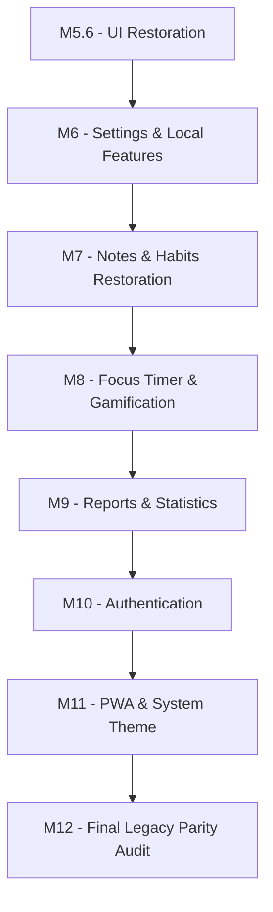

# Legacy Restoration Plan: Roadmap to Feature Parity v1.0

Dokumen ini memetakan rencana strategis pemulihan fitur (Legacy Restoration Plan) untuk membawa aplikasi React + TypeScript mencapai 100% Feature Parity dengan versi JavaScript Legacy (Single Source of Truth).

---

## 1. Ringkasan Hasil Audit
Berdasarkan [LEGACY_PARITY_AUDIT.md](file:///Users/jofi/Documents/PROJECT/LifeFlow/docs/project/LEGACY_PARITY_AUDIT.md), status keselarasan fitur dikelompokkan sebagai berikut:

- **COMPLETE**: Tasks CRUD, Categories CRUD, Calendar View, Undo/Redo, Local Storage, Global Toast & Skeletons.
- **PARTIAL**: Dashboard (Quotes & Heatmap), Notes (Pinning & Deadlines), Theme (System Default).
- **MISSING**: Focus Timer, Statistics/Reports, Settings Page, Authentication (Firebase Auth), PWA Offline caching.

---

## 2. Urutan Milestone & Prioritas Implementasi
Sesuai dengan aturan dependensi, milestone dirancang sedemikian rupa agar fitur lokal dan data dasar diselesaikan terlebih dahulu sebelum melangkah ke fitur cloud dan Progressive Web App.

---

## 3. Architecture Decision

LifeFlow menggunakan pendekatan **Offline First Architecture**.

**Prinsip:**
* Seluruh fitur inti harus dapat digunakan tanpa login.
* Seluruh data disimpan terlebih dahulu di Local Storage.
* Authentication merupakan fitur tambahan untuk sinkronisasi cloud.
* Login tidak boleh menjadi syarat menggunakan aplikasi.
* Cloud Sync adalah enhancement, bukan dependency fitur inti.

---

## 3. Dependency Rules (Aturan Ketergantungan)
1. **Authentication** tidak boleh menjadi milestone pertama.
2. **Settings** harus selesai sebelum Authentication diimplementasikan.
3. **Dashboard Feature Parity** dikerjakan pada M6 karena tidak bergantung pada modul Focus Timer.
4. **Notes Restoration** dan **Habit Restoration** dipisahkan menjadi task yang saling terpisah.
5. **Reports** memprioritaskan implementasi menggunakan perilaku proyek JavaScript Legacy asli (tidak bergantung mutlak pada Chart.js di awal). Jika diperlukan peningkatan teknologi, akan dicatat sebagai enhancement *setelah* Feature Parity tercapai.
6. **PWA** ditempatkan pada fase akhir (menjelang Final Release Candidate) guna menghindari isu agresivitas caching selama tahapan pengembangan.

---

## 4. Roadmap Evolution Policy
Proses transisi perencanaan menuju eksekusi wajib mematuhi aturan berikut:
* **LEGACY_PARITY_AUDIT.md** adalah dokumen audit.
* **LEGACY_RESTORATION_PLAN.md** adalah dokumen perencanaan.
* **TASK_BOARD.md** tetap menjadi Single Source of Truth untuk seluruh pekerjaan implementasi.
* **TIDAK ADA** implementasi yang boleh dimulai hanya berdasarkan LEGACY_RESTORATION_PLAN.md.
* Sebuah fitur baru hanya boleh dikerjakan **SETELAH** dipindahkan ke `TASK_BOARD.md` lengkap dengan atribut berikut:
  * Task ID
  * Description
  * Dependencies
  * Acceptance Criteria
  * Status

---

## 5. Detail Milestone & Task-Task Baru

### Milestone 6 (M6) — Settings & Local Features
Fokus: Menyelesaikan seluruh dependensi UI lokal, sinkronisasi preferensi dasar, serta mengembalikan fitur dashboard yang hilang.

#### [TASK-M6-01] Settings Page & Data Management
- **Description**: Membangun halaman Settings lengkap berisi form konfigurasi preferensi, toggles notifikasi, tombol Ekspor/Impor data (JSON Backup), serta dialog konfirmasi fitur Reset Data (Danger Zone).
- **Priority**: High
- **Dependencies**: M5.6
- **Acceptance Criteria**: Pengguna dapat mengubah setelan (yang disimpan di local storage), serta melakukan backup dan restore seluruh data aplikasi secara mandiri menggunakan file JSON.
- **Estimasi Risiko**: Medium (Validasi format skema data JSON yang diimpor).
- **Estimasi File Berubah**: Halaman `Settings.tsx` baru, file CSS terkait, serta utility impor/ekspor.

#### [TASK-M6-02] Dashboard Feature Parity
- **Description**: Melengkapi celah paritas dashboard dengan menambahkan logika Randomizer Kutipan (Dynamic Quotes) dan memetakan 30-hari Activity Heatmap agar terkoneksi dengan persentase sesungguhnya pada `historyData`.
- **Priority**: Medium
- **Dependencies**: TASK-M6-01
- **Acceptance Criteria**: Quote berubah acak setiap reload (mengikuti list legacy); Heatmap mewakili persentase yang tepat dari data local storage masa lalu.
- **Estimasi Risiko**: Low.
- **Estimasi File Berubah**: `Dashboard.tsx`, utils quotes generator.

---

### Milestone 7 (M7) — Notes & Habits Restoration
Fokus: Pemulihan pengaturan lanjut pada modul Catatan (Notes) dan penjadwalan Kebiasaan (Habits).

#### [TASK-M7-01] Notes Metadata & Pinning Restoration
- **Description**: Menambahkan kolom opsi (Tenggat Waktu/Deadline, Jam/Time, Pengingat/Reminder) serta fitur Pin (📌) pada editor.
- **Priority**: High
- **Dependencies**: M6
- **Acceptance Criteria**: Item list notes bereaksi pada pin state dengan meloncat ke atas daftar. Data deadline dan reminder terekam pada storage note terkait.
- **Estimasi Risiko**: Low.
- **Estimasi File Berubah**: `Notes.tsx`, ekstensi model tipe `Note` di AppContext.

#### [TASK-M7-02] Habit Scheduling & Repeat Rules
- **Description**: Merefaktorkan data Habit agar selaras dengan skema pengulangan legacy (repeat rules: harian, mingguan, bulanan, hari-hari tertentu) dan mengaktifkan filter hari-H.
- **Priority**: High
- **Dependencies**: M6
- **Acceptance Criteria**: Habit hanya muncul jika jadwal pengulangannya jatuh tepat pada tanggal berjalan; mendukung konfigurasi hari spesifik saat pembuatan habit.
- **Estimasi Risiko**: High (Risiko regresi data struktur Habit).
- **Estimasi File Berubah**: Model habit di AppContext, `Habits.tsx`, Form modal Habit.

---

### Milestone 8 (M8) — Focus Timer & Gamification
Fokus: Pengalaman timer interaktif yang diwarnai hadiah level-up.

#### [TASK-M8-01] Focus Timer Module
- **Description**: Mereplika UI Focus Timer yang berisi countdown timer visual bundar dan opsi durasi 25, 50, 15, dan 5 menit, lengkap dengan kontrol aksi start/pause/reset.
- **Priority**: High
- **Dependencies**: M7
- **Acceptance Criteria**: Timer menghitung mundur dengan interval browser yang stabil, tidak freeze.
- **Estimasi Risiko**: Medium.
- **Estimasi File Berubah**: Halaman `FocusTimer.tsx` baru.

#### [TASK-M8-02] Focus XP Integration, Sound & Confetti
- **Description**: Memicu selebrasi dan reward usai durasi selesai. Menambahkan poin ke total XP, memainkan sound effect, dan meluncurkan animasi confetti seperti di versi legacy.
- **Priority**: Medium
- **Dependencies**: TASK-M8-01
- **Acceptance Criteria**: Saat timer mencapai 0, +5 XP ditambahkan ke AppContext, dan canvas confetti menutupi layar sejenak.
- **Estimasi Risiko**: Low.
- **Estimasi File Berubah**: `FocusTimer.tsx`, file utilitas audio/confetti.

---

### Milestone 9 (M9) — Reports & Statistics
Fokus: Mengembalikan halaman rekapitulasi data dan kemampuan berbagi analitik ke jejaring sosial.

#### [TASK-M9-01] Reports Dashboard & Productivity Analytics
- **Description**: Membangun tampilan ringkasan progres harian (Productivity Analytics) dan penyusunan grafik yang sejalan dengan pendekatan Legacy (tanpa bergantung penuh ke pustaka eksternal mutlak, disesuaikan dengan status single source of truth).
- **Priority**: High
- **Dependencies**: M8
- **Acceptance Criteria**: Terdapat dashboard reports yang mengakumulasikan tren tugas terselesaikan dalam seminggu ke belakang.
- **Estimasi Risiko**: Medium (Logika rekapitulasi waktu `historyData`).
- **Estimasi File Berubah**: Halaman `Reports.tsx` baru.

#### [TASK-M9-02] Canvas / Share Image Generator
- **Description**: Fungsi untuk menggambar statistik (Level, Streak, Productivity) menggunakan API Canvas 2D untuk kemudian diekspor/dishare menjadi gambar instastory.
- **Priority**: Low
- **Dependencies**: TASK-M9-01
- **Acceptance Criteria**: Tombol Share mampu mendownload image berformat yang berisikan rincian statistik kustomisasi atas background user.
- **Estimasi Risiko**: Medium.
- **Estimasi File Berubah**: Modul share terpisah atau menyatu dengan halaman Reports.

---

### Milestone 10 (M10) — Authentication
Fokus: Firebase Web SDK dan fungsionalitas masuk akun.

**Notes**:
Authentication bersifat opsional.
Semua modul sebelum M10 harus tetap berjalan penuh tanpa akun pengguna.
Firebase Authentication hanya digunakan untuk:
* Cloud Sync
* Multi-device Sync
* Backup Online
* User Profile

dan tidak boleh menjadi dependency untuk penggunaan lokal.

#### [TASK-M10-01] Firebase Auth & User Profile Sync
- **Description**: Integrasi SDK Firebase (Authentication/Google Login), implementasi Login Modal, serta sinkronisasi hasil profil Auth ke navigasi Header dan Sidebar.
- **Priority**: High
- **Dependencies**: M9
- **Acceptance Criteria**: Pengguna sukses memicu modal Google login, lalu info profilnya tampil secara dinamis menggantikan skeleton fallback.
- **Estimasi Risiko**: Medium (Penyesuaian Environment Variables).
- **Estimasi File Berubah**: Konfigurasi `firebase.ts`, `App.tsx` context, `Navbar.tsx`, `Sidebar.tsx`.

---

### Milestone 11 (M11) — PWA & System Theme
Fokus: Offline support, instalasi aplikasi, dan sinkronisasi OS theme.

#### [TASK-M11-01] PWA Service Worker & Offline Support
- **Description**: Pembuatan `manifest.json`, integrasi Service Worker untuk resource caching (JavaScript, HTML, aset CSS/font), dan fallback halaman saat tidak ada jaringan.
- **Priority**: High
- **Dependencies**: M10
- **Acceptance Criteria**: Peramban memunculkan prompt instalasi (Installable PWA); Mematikan jaringan internet tidak memutuskan akses terhadap data localStorage aplikasi.
- **Estimasi Risiko**: Medium (Cache busting saat deployment update).
- **Estimasi File Berubah**: File statis `public/`, `index.html`.

#### [TASK-M11-02] System Theme Detection
- **Description**: Penambahan listener untuk mode "System Theme" yang bereaksi saat preferensi pengguna (Light/Dark mode) diubah pada tingkat sistem operasi.
- **Priority**: Low
- **Dependencies**: M10
- **Acceptance Criteria**: Jika profil di-set pada System, aplikasi akan beralih langsung saat OS Mac/Windows diubah setelannya.
- **Estimasi Risiko**: Low.
- **Estimasi File Berubah**: Setup listener `window.matchMedia` di bagian mount lifecycle `App.tsx`.

---

### Milestone 12 (M12) — Final Legacy Parity Audit
Fokus: Verifikasi RC dan validasi menyeluruh menuju Rilis Akhir v1.0.

#### [TASK-M12-01] Final Feature Parity Audit & Manual UAT
- **Description**: Audit piksel dan interaktif antara versi React TS yang telah jadi dengan source asli JavaScript Legacy. Pelaksanaan regresi (Manual UAT) pada alur kritis.
- **Priority**: Critical
- **Dependencies**: Keseluruhan fase terdahulu.
- **Acceptance Criteria**: Semua kriteria di dalam `LEGACY_PARITY_AUDIT.md` tercentang/status terselesaikan, dan siap rilis sebagai Release Candidate 1 (v1.0-RC1).
- **Estimasi Risiko**: Low.
- **Estimasi File Berubah**: Evaluasi & Bugfixing komprehensif pada lint report.
